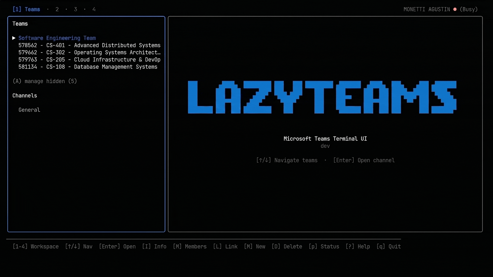

<p align="center">
  
</p>

<p align="center">
  A keyboard-driven Microsoft Teams client for the terminal.
</p>

<p align="center">
  <a href="https://lazyteams.agmonetti.workers.dev">Explore</a> ✦
  <a href="#quick-start">Quick Start</a> ✦
  <a href="https://lazyteams.agmonetti.workers.dev/#first-time-setup">Getting Started</a> ✦
  <a href="https://lazyteams.agmonetti.workers.dev">Documentation</a> ✦
  <a href="CONTRIBUTING.md">Contributing</a> ✦
  <a href="SECURITY.md">Security</a> ✦
  <a href="LICENSE">License</a>
</p>

TUI client for Microsoft Teams. Runs entirely in the terminal — no Electron, no browser. Built with **Clean Architecture + Elm Architecture (Bubble Tea)**. Single static binary.

<p align="center">
  
</p>

## Highlights

- **4 workspaces**: Teams & Channels, DMs & Group Chats, Activity, Education Assignments.
- **Chat**: send/edit/delete messages, threads with inline replies, @mentions autocomplete, reactions, read receipts, clipboard image paste (`Ctrl+P`), native Markdown rendering, live search (`/`), infinite scroll.
- **Files**: recursive Drive browser, chunked uploads, multi-file downloads, inline text preview, Office Online fallback, create/delete folders.
- **Team management**: create/delete teams and channels, member management (including private channels via internal APIs), hide/unhide items.
- **Direct messages**: user search (external users by exact email), personal notes auto-discovery, dynamic sorting by unread + activity, presence indicators.
- **Assignments**: view instructions, download reference materials, upload/submit/undo-submit your work.
- **Presence**: read contacts and set your own status.
- **Mobile Mode**: single-panel responsive layout for narrow terminals (`Ctrl+B`, auto below 120 cols).

## Requirements

- Go 1.26.6+
- Microsoft Teams account (university or enterprise)
- Linux, macOS, or Windows. Playwright requires Firefox for the `auth-helper`.

## Quick Start

```bash
# Build the TUI and the Auth Helper
go build -o lazyteams .
go build -o lazyteams-auth ./cmd/auth-helper/

# Capture tokens (first time, interactive)
./lazyteams-auth

# Run
./lazyteams

# Show CLI help (usage, auth commands, config paths)
./lazyteams --help
```

First-time setup requires granting a set of Microsoft Graph permissions once (see [the docs](https://lazyteams.agmonetti.workers.dev/#first-time-setup)). The TUI renews expired tokens automatically in the background.

Note: binaries built directly with `go build` report `dev` as their version. Build through `make build VERSION=v1.2.3` or the release workflow to embed a version (shown by `./lazyteams --version`).

## Documentation

Full documentation — first-time setup, token system, configuration files, keybindings, platform support, and architecture — lives on the docs site:

- [Documentation](https://lazyteams.agmonetti.workers.dev)
- [Troubleshooting](https://lazyteams.agmonetti.workers.dev/troubleshooting.html)
- [FAQ](https://lazyteams.agmonetti.workers.dev/faq.html)

Security-sensitive data handling is described in [`SECURITY.md`](SECURITY.md).

## Disclaimer

Educational tool. Operates on already-authenticated Microsoft Teams sessions. Does not distribute proprietary Microsoft binaries. *Not affiliated with Microsoft Corporation.*

## Legal and Responsible Use

- Use lazyteams only with accounts and tenants you are authorized to access.
- Follow Microsoft's Terms of Service and your organization's policies.
- `Microsoft` and `Microsoft Teams` are trademarks of Microsoft Corporation; this project is independent and unofficial.
- If Microsoft changes APIs, auth flows, or platform restrictions, some features may stop working until updated.

## License

This project is licensed under the **GNU General Public License v3.0 (GPLv3)**. See the [LICENSE](LICENSE) file for more details.
