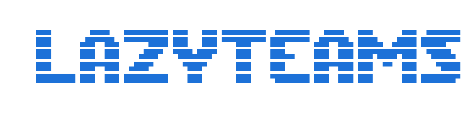

# ms-teams-TUI

<p align="center">
  
</p>

<p align="center">
  A fast, keyboard-driven Microsoft Teams client for the terminal.
</p>

Cliente TUI para Microsoft Teams. Corre en la terminal, sin Electron, sin navegador.

**~3,500 líneas de Go.** Clean Architecture + Elm Architecture (Bubble Tea). Un solo binario estático.

```
╔══════════════════════╦════════════════════════════════════════════════════════╗
║ Chats                ║            TEAMS-TUI                                   ║
║                      ║                                                        ║
║ ► Notas personales   ║  Microsoft Teams Terminal UI                           ║
║   CHAT PRIVADO 1     ║  v1.0.0-beta                                           ║
║   CHAT PRIVADO 2     ║                                                        ║
║   CHAT PRIVADO 3     ║  [↑/↓] Navegar equipos · [Enter]                       ║
║   ...                ║                                                        ║
║                      ║                                                        ║
╠══════════════════════╩════════════════════════════════════════════════════════╣
║ [1] Equipos  [2] DMs  [3] Actividad  [4] Tareas   [p] Estado  [q] Salir       ║
╚═══════════════════════════════════════════════════════════════════════════════╝
```

## Features

- **4 Workspaces**: Equipos y canales, DMs, Actividad/Notificaciones, Tareas educacionales
- **Mensajes**: Leer y enviar mensajes (RichText/Html), auto-refresh cada 15s, links clickeables (OSC 8)
- **Archivos**: Navegador de Drive recursivo, multi-selección, descarga con directorio personalizable
- **Presencia**: Leer y cambiar tu estado (Available, Busy, DoNotDisturb, etc.)
- **Notificaciones**: Filtros por tipo, navegar al canal origen
- **Auto-descubrimiento**: Chat personal ("Notas personales"), nombres inteligentes de grupos

## Requisitos

- Go 1.24+
- Cuenta de Microsoft Teams (universitaria o empresarial)
- Linux (testeado en Arch). Playwright necesita Firefox (para el auth helper).

## Quick Start

```bash
# Compilar
go build -o msTTui .
go build -o msTTui-auth ./cmd/auth-helper/

# Capturar tokens (primera vez, ~90s)
./msTTui-auth

# Ejecutar
./msTTui
```

## Tokens

msTTui necesita 5 tokens para conectarse a las APIs de Teams. El helper `msTTui-auth` los captura automáticamente via Playwright (Firefox) en ~90 segundos:

| Token | Expiración | Uso |
|-------|-----------|-----|
| `MS_GRAPH_TOKEN` | ~1h | Chats, equipos, canales, presencia, archivos |
| `TEAMS_WEB_TOKEN` | ~24h | Leer/escribir mensajes (ChatSvc) |
| `TEAMS_NOTIF_TOKEN` | ~24h | Notificaciones push |
| `EDU_TOKEN` | ~1h | Tareas/Assignments educativos |
| `TEAMS_COOKIE` | ~24h | Autenticación de sesión |

Los tokens se guardan en `~/.config/teamstui/tokens.env`. No hay renovación automática — corré `./msTTui-auth` de nuevo cuando expiran.

## Arquitectura

```
msTTui/
├── main.go                          # Entry point
├── cmd/
│   ├── auth-helper/                 # Playwright auth helper (captura 5 tokens)
│   ├── debug-assignments/           # Debug tool para Education API
│   └── debug-endpoints/             # Debug tool para endpoints
└── internal/
    ├── auth/                        # Tokens (lectura + JWT parsing)
    ├── graph/                       # HTTP client para Microsoft Graph API
    │   ├── client.go                # Client, doReq(), cleanHTML()
    │   ├── teams_api.go             # Equipos y canales
    │   ├── chats_api.go             # Chats, auto-descubrimiento self-chat
    │   ├── messages_api.go          # Leer/escribir mensajes (ChatSvc)
    │   ├── files_api.go             # Navegador de Drive, remote items
    │   ├── presence_api.go          # Get/Set/Clear presencia
    │   ├── assignments_api.go       # Education Assignments (bloqueado por WAF)
    │   ├── activity_api.go          # Notificaciones via ChatSvc
    │   └── download_api.go          # Descarga de archivos
    ├── teams/teams.go               # Agregación de adjuntos, iconos de archivos
    └── ui/                          # TUI (Elm Architecture con Bubble Tea)
```

**Clean Architecture**: `ui` nunca hace llamadas HTTP. Toda red pasa por `graph` y `teams` vía comandos `tea.Cmd` (async).

## Documentación

**[Documentación completa](https://ms-teams-tui.agmonetti.workers.dev/)** — Atajos de teclado, configuración, limitaciones, guía de desarrollo y más.

## Seguridad

- Tokens almacenados en texto plano (`~/.config/teamstui/tokens.env`)
- API ChatSvc es undocumented/private — Microsoft puede romperla en cualquier momento
- Browser session de Playwright guarda cookies en disco

## Disclaimer

Herramienta educacional. Opera sobre sesiones de Microsoft Teams ya autenticadas. No distribuye binarios propietarios de Microsoft. *No affiliated with Microsoft Corporation.*
